 

# Introdução

Este é um dos repositórios do projeto de alunos do Inteli em parceria com uma grande indústria de papel nacional no 1º semestre de 2023. Este projeto foi desenvolvido por alunos do Módulo 6 do curso de Ciência da Computação.

# Projeto: *Solução de otimização de corte de bobinas de papel*

# Grupo: *Blade Runners*

# Alunos

* André Luís Lessa Junior
* Gábrio Lina
* João Pedro Alcaraz
* Leandro Custódio
* Luiz Carlos
* Mateus Rafael
* Thomas Brand

# Descrição

As principais empresas brasileiras no setor de papel e celulose, têm como foco a produção de papel para embalagens, papelão ondulado, sacos industriais e outros produtos. Em suas buscas contínuas por aprimorar a eficiência produtiva e diminuir as perdas, enfrentam um desafio significativo no planejamento industrial do setor de produção de papel. Nesse contexto, o algoritmo de conjugação de bobinas desempenha um papel fundamental, sendo utilizado diariamente para atender aos pedidos de diversos clientes. O objetivo é maximizar a conjugação de bobinas e minimizar o desperdício, transformando este grande desafio em um problema de utilização essencial para o sucesso destas empresas.

# Guia de instalação

## Guia para preparar o ambiente de desenvolvimento

1 - Instalar JDK 19 (https://docs.oracle.com/en/java/javase/19/install/installation-jdk-microsoft-windows-platforms.html#GUID-DAF345BA-B3E7-4CF2-B87A-B6662D691840)

2 - Instalar Maven 3.6.3 (https://maven.apache.org/download.cgi)

3 - Instalar Git (https://git-scm.com/downloads)

4 - Instalar IDE de sua preferência (Visual Studio Code, IntelliJ, NetBeans, etc)

5 - Clonar o repositório do projeto (exemple de como clonar: https://docs.github.com/pt/github/creating-cloning-and-archiving-repositories/cloning-a-repository)

6 - Abrir o projeto na IDE

7 - Executar o comando 'mvn clean install' no terminal da IDE

## Guia para execução
### Requisitos mínimos

Para utilizar a aplicação foi testado em um computador com as seguintes específicações:

11th Gen Intel(R) Core(TM) i5-1145G7 @ 2.60GHz 1.50 GHz 16,0 GB RAM

A aplicação consumiu 11% da CPU no pior caso e 183MB heap memory, ou seja, uma memória local, então para que o programa execute no computador do usuário deve-se ter uma CPU com a frenquência superior a 0.286GHz e um espaço acima de 183MB para heap memory.

### Formato de dados

Para inserir os dados na aplicação é necessário utilizar uma planilha excel, ou seja, um arquivo xlsx.

Para entender melhor a formatação de dados, utilizamos uma planilha teste, para acessar é necessário navegar pelo seguinte diretório:

grupo1_publico -> codigo -> data -> "Dados de Exemplo.xlsx"

Nesta pasta estará o template em formato excel

### Execução

Para executar a aplicação é necessário navegar pelos seguinte diretório:

grupo1_publico -> codigo -> planejador -> src -> main -> java -> inteli -> cc6 -> Forms

Ao encontrar o diretório abrir o arquivo Main onde está o inicio da aplicação em desktop, criada com Swing e Processing para desenhar as bobinas, após isso execute o programa e aguarde que aplicação seja iniciada.

Ao finalizar o processo de executar o programa, o usuário será direcionado para uma tela de carregamento, e então, para a página principal do aplicativo.
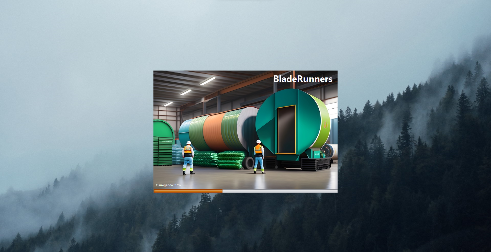
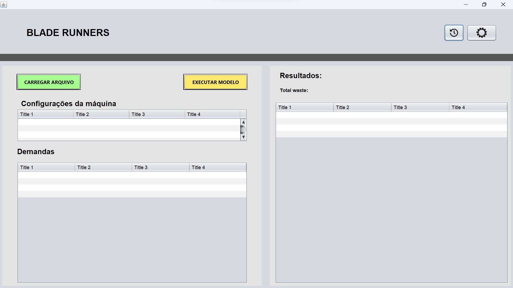

O primeiro passo a ser realizado é carregar o arquivo que contém todas as informações do pedido, para isso clique no botão "Carregar arquivos" que está em vermelho na imagem abaixo:

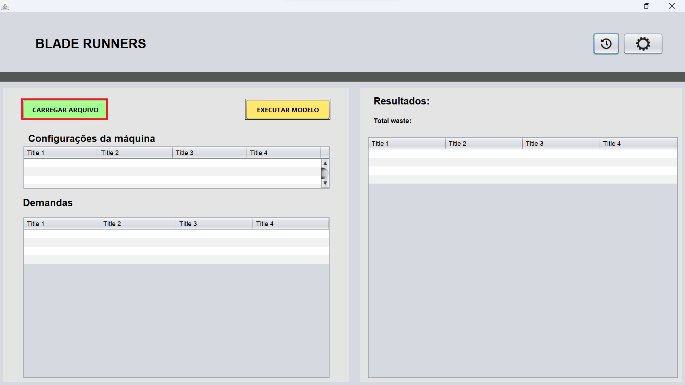

Após clicar o botão irá abrir uma janela para navegar pelo diretório do computador.

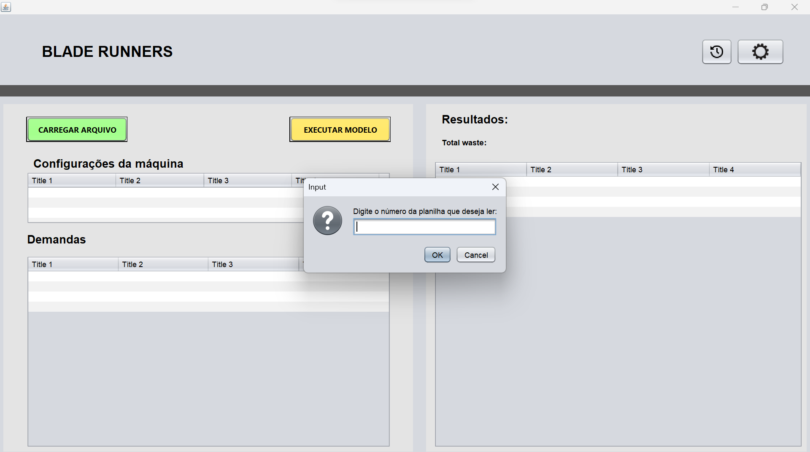

Ao selecionar o arquivo, uma janela para escolher qual planilha gostaria de usar. Essa função foi criada devido, algumas planilhas possuem mais de uma pasta, então a partir do mesmo arquivo o usuário pode selecionar qual usar.

Após digitar o número da pasta e clicar em "Ok" irá aparecer uma confirmação que o pedido foi carregado.

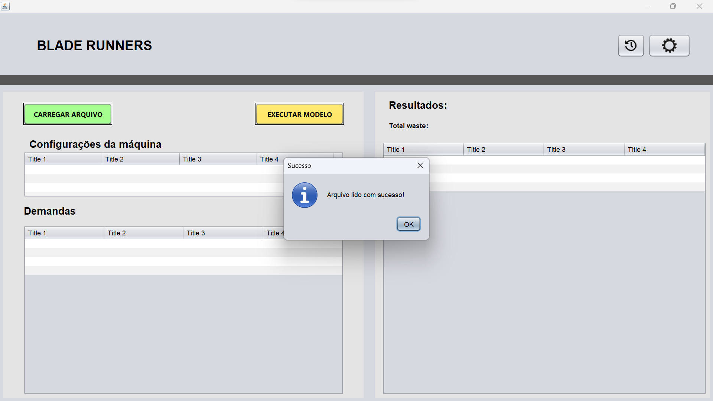

Clique em "Ok" novamente e o pedido será carregado na tela inicial.

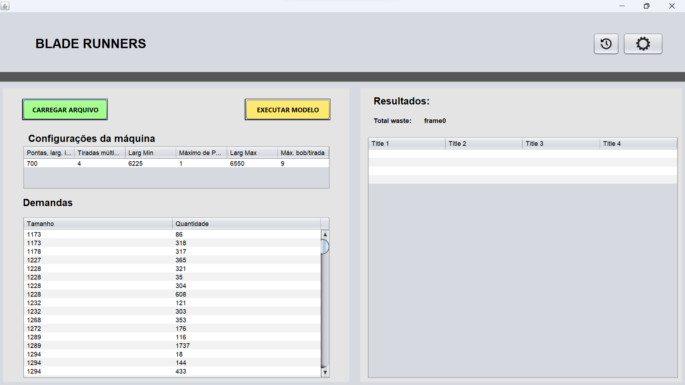

Também é possível alterar as configurações para geração de população, é importante ressaltar que a modificação desse parâmetro deve ser realizado por pessoas que entendem sobre o algoritmo, para isso clique no botão em vermelho no topo do lado direito:

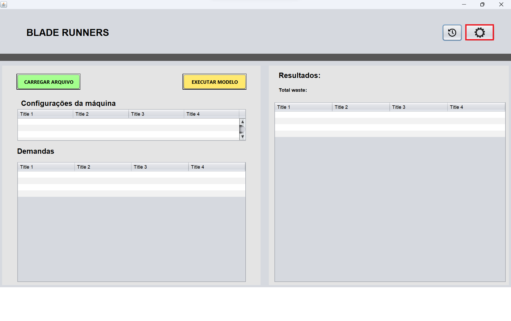

Ao clicar aparecerá as operações padrão, entretanto elas podem ser alteradas. Após realizar as alterações necessárias clique em "Salvar". Os parâmetros "quantidade de padrões base a serem gerados" e "tamanho da população gerada" podem ser definidos em 8000 e 200 respectivamente, para se obter um bom resultado geral.

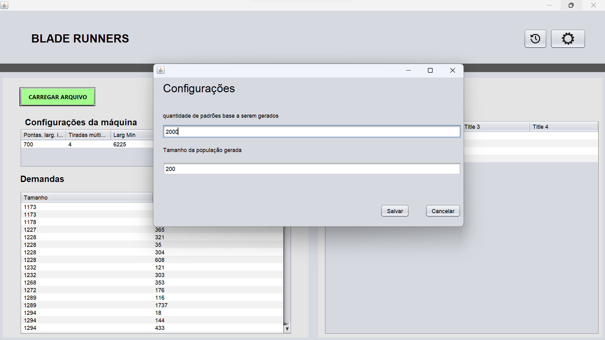

Caso não queira modificar as configurações, execute a aplicação para gerar os melhores padrões de corte clicando em "Executar modelo" que está em vermelho na imagem abaixo:

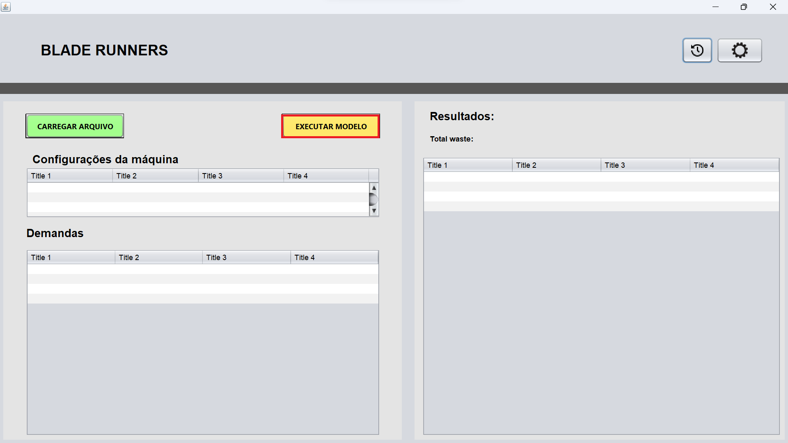

Ao terminar de executar irá aparecer uma janela confirmando a operação. Caso o processo ocorra sem erros, um novo botão verde "visualizar bobinas" deve ser exibido.

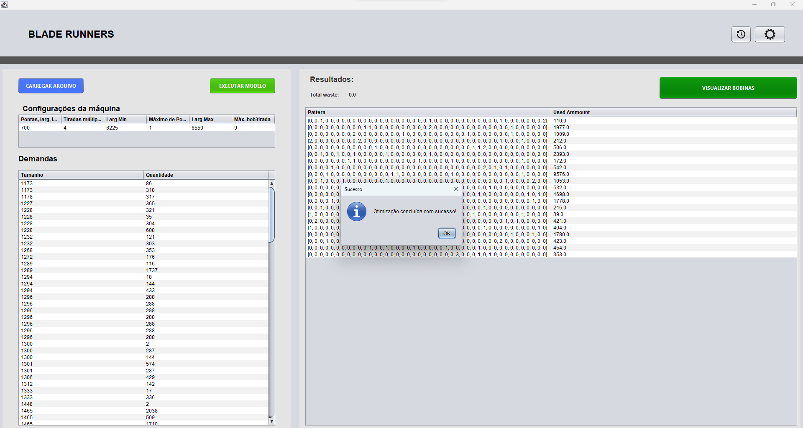

Ao clicar em "Ok", usuário terá a visualização dos padrões ao lado direito da tela.

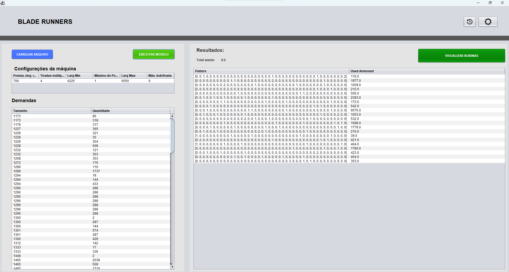

O usuário pode também visualizar os desenhos das bobinas de cada padrão, para isso é necessário clicar no botão verde "Visualizar Bobinas" e utilizar o botão scroll do mouse para navegar entre os desenhos.

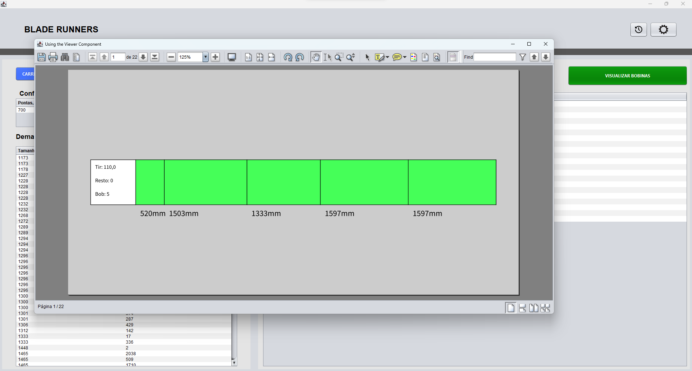

O algoritmo pode gerar para a mesma demanda padrões diferentes, logo utilize a seção histórico para visualizar os padrões, sendo necessário clicar no botão no topo superior direito da tela em vermelho:

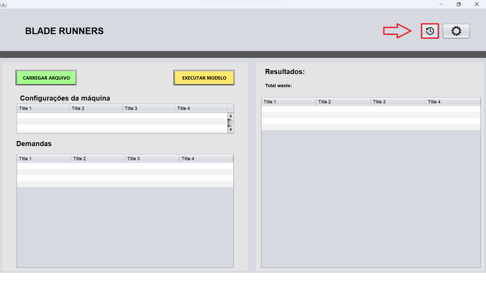

Ao clicar no botão para abrir aparecerá a seguinte tela:

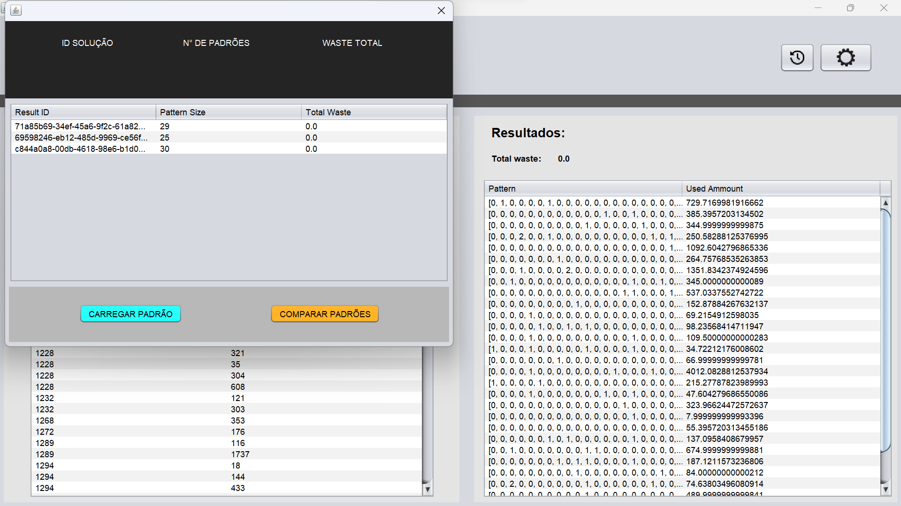

Ao selecionar um deles e clicar "Carregar padrão" o usuário poderá ver no menu inicial o padrão que foi selecionado.

Ao selecionar comparar padrões o usuário irá poderá visualizar quais são os melhores padrões gerados através da tela abaixo:

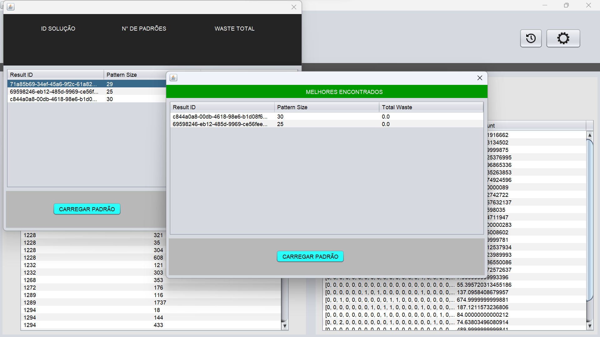

Ao selecionar um deles e clicar "Carregar padrão" o usuário poderá ver no menu inicial o melhor padrão selecionado.

# Licença

Este projeto utiliza a [licença Apache 2.0](LICENSE).